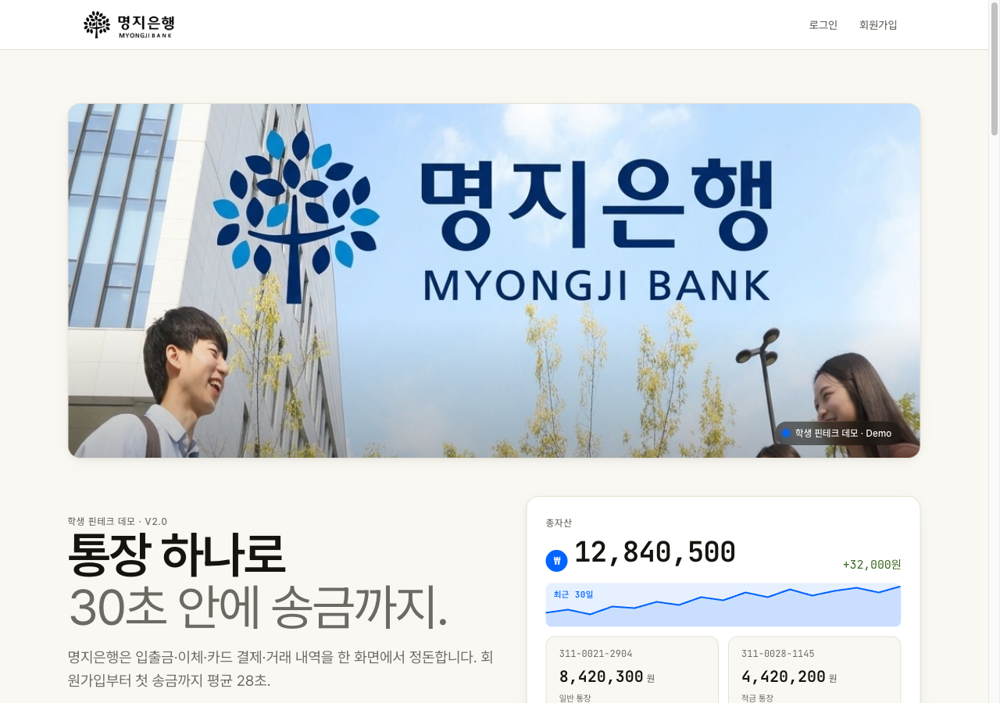
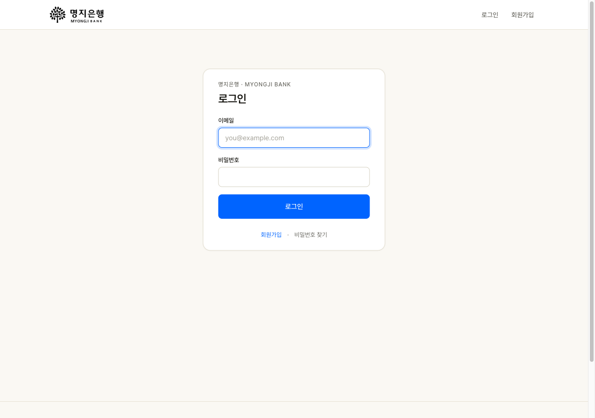
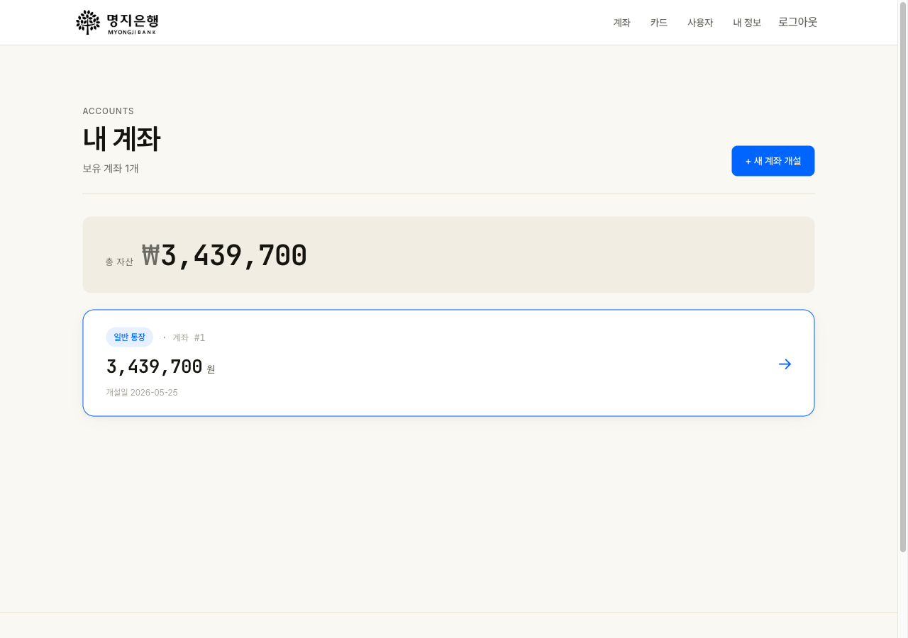
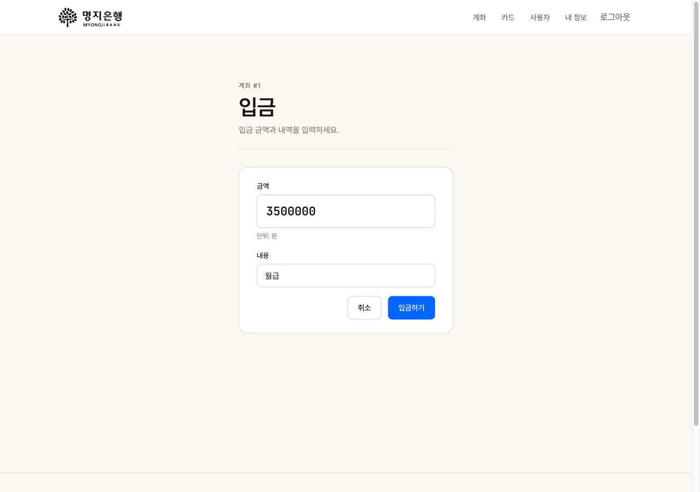
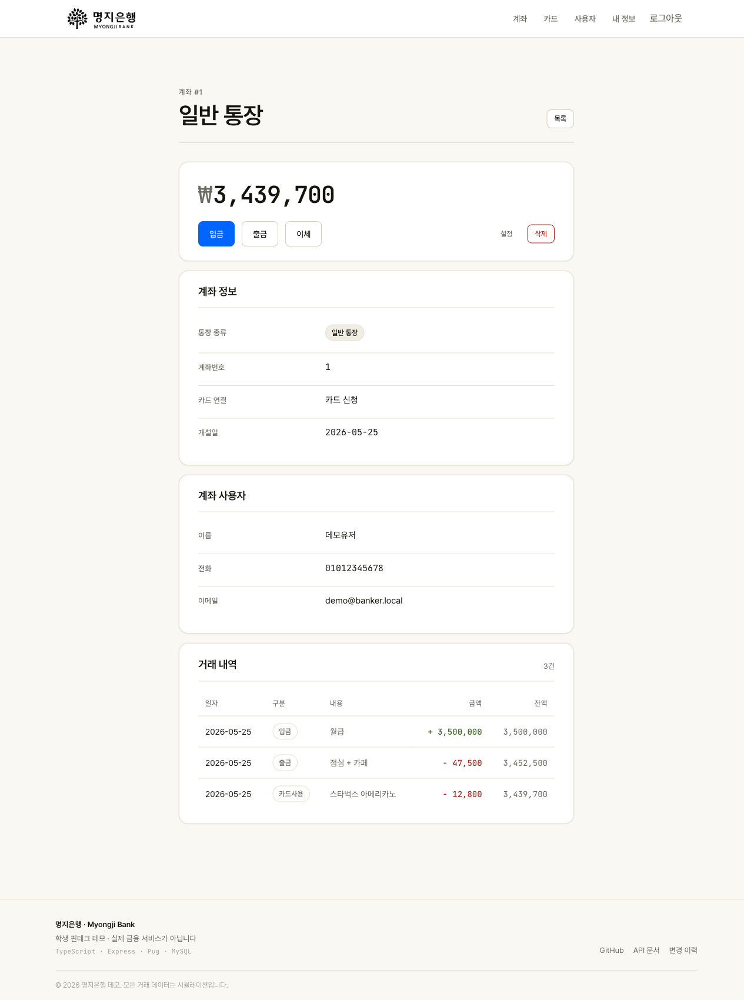
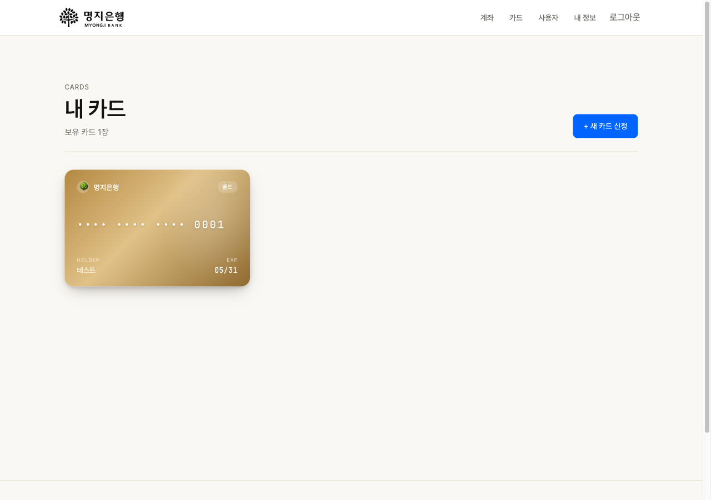
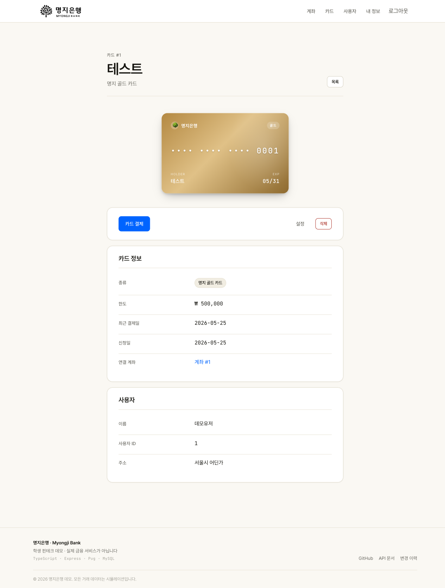

# banker-web

명지은행 데모 — 계좌·카드·이체·거래 내역까지 다루는 풀스택 웹 애플리케이션.
TypeScript + Express + MySQL 8 + Pug SSR. Docker compose 한 번에 띄운다.

> 마지막 업데이트: 2026-05-25 · 학생 핀테크 데모 · 실제 금융 서비스 아님

## 화면

| | |
|---|---|
|  |  |
| 메인 — 명지은행 점보트론 + 마케팅 히어로 | 로그인 |
|  |  |
| 내 계좌 — 총자산 + 계좌 카드 | 입금 폼 — 거대 mono 금액 입력 |
|  |  |
| 계좌 상세 — 잔액·액션바·거래 내역 | 내 카드 — 플라스틱 카드 그리드 |
|  | |
| 카드 상세 — 큰 플라스틱 카드 + 정보 | |

## 한 줄 실행

```bash
cp .env.example .env
docker compose up
```

`http://localhost:8080` 으로 접속, 시드 유저
`demo@banker.local` / `password123`로 로그인.

## 스택

- 백엔드: Node 20 + Express 4 + TypeScript (strict)
- 인증: Passport LocalStrategy + bcrypt
- 데이터: MySQL 8 (`mysql2/promise` 풀)
- 뷰: Pug SSR + 자체 디자인 시스템 (`.lp-*` 랜딩, `.app-*` 인너 페이지, `.bank-card` 플라스틱 카드)
- 보안: helmet, csurf, CSRF 토큰을 모든 폼에 자동 주입
- 테스트: Jest + Supertest, GitHub Actions CI
- 배포: docker compose (app + mysql + nginx 리버스 프록시)

## 디렉토리

```
src/
  app.ts                 Express 부트스트랩, 미들웨어, 라우트 마운트
  bin/www.ts             HTTP 서버 시작
  lib/db.ts              mysql2 풀 + withTransaction 헬퍼
  lib/passport.ts        LocalStrategy + bcrypt.compare
  lib/http-error.ts      HttpError + 4xx 헬퍼들
  middlewares/           needAuth, errorHandler, validateForm
  models/                users / accounts / cards / history 저장소
  routes/                index / auth / users / accounts / cards / health
  types/domain.ts        도메인 인터페이스
views/                   Pug 템플릿 (랜딩 + 인너 페이지 + 공유 partial)
public/                  정적 자산 (style.css, 이미지)
docs/                    설계 문서, 스크린샷, API 표
db/init.sql              스키마 + 시드 (compose가 첫 부팅 때 적용)
nginx/default.conf       리버스 프록시 설정
tests/                   jest 스위트
.github/workflows/ci.yml lint + test + docker build
```

## 환경 변수

| 변수 | 기본 | 설명 |
|---|---|---|
| `NODE_ENV` | development | `production`이면 세션 쿠키 secure, 또한 transfer `?fail=1` 센티넬 비활성 |
| `PORT` | 3000 | 앱 리스닝 포트 (컨테이너 내부) |
| `HTTP_PORT` | 8080 | 호스트에서 nginx로 매핑되는 포트 (compose 전용) |
| `SESSION_SECRET` | — | **필수**. 없으면 부팅 거부 |
| `DB_HOST` | localhost | compose에선 `db`로 덮어쓴다 |
| `DB_PORT` | 3306 | |
| `DB_USER` / `DB_PASSWORD` | banker / banker | |
| `DB_NAME` | bank | |
| `DB_CONNECTION_LIMIT` | 10 | |
| `DB_ROOT_PASSWORD` | rootpass | compose 전용. MySQL 컨테이너 root 비밀번호 |

`.env.example` 복사 후 채워 쓰면 된다.

## 개발

### docker compose dev

```bash
docker compose up
```

`docker-compose.override.yml`이 자동 적용돼서 `tsx watch`로 핫리로드 +
`src/`, `views/`, `public/`이 바인드 마운트된다.

### 호스트에서 직접 실행

MySQL을 따로 띄워두고:

```bash
npm install
npm run build       # tsc -> dist
npm start           # dist 실행
# 또는
npm run dev         # tsx watch
```

### 타입 체크 / 테스트

```bash
npm run typecheck
npm test
```

테스트는 단일 worker로 실행되며 같은 DB(`127.0.0.1:3307` 기본)에 대해
`TRUNCATE`-and-reseed 패턴으로 격리한다. 사전에 mysql 컨테이너가 떠
있어야 한다:

```bash
docker run -d --name banker-test-mysql -p 3307:3306 \
  -e MYSQL_ROOT_PASSWORD=rootpass -e MYSQL_DATABASE=bank \
  -v "$(pwd)/db/init.sql:/docker-entrypoint-initdb.d/init.sql:ro" \
  mysql:8.0
```

CI에서는 `services.mysql`이 같은 일을 한다.

## 라우트

전체 라우트 표는 [`docs/API.md`](docs/API.md) 참고.

## 보안 메모

- 비밀번호: bcrypt cost 12 해시. 평문 저장 없음.
- 세션: `httpOnly` + `sameSite=lax` 쿠키. 프로덕션에선 `secure` 자동 켜짐.
- CSRF: csurf, 모든 form에 `+csrf` mixin으로 hidden input 주입. DELETE는
  `+deleteForm` mixin이 method=POST + `_method=DELETE` 폼으로 발급.
- methodOverride는 POST만 처리 — GET 링크로 DELETE/PUT 우회 불가.
- 이체 / 입금 / 출금 / 카드 사용: 단일 DB 트랜잭션 (`SELECT ... FOR UPDATE`)
  으로 잔액 변경 + history 기록을 묶어 부분 실패에서도 일관성 유지.

## 트러블슈팅

**`SESSION_SECRET is required` 에러**
`.env.example`을 `.env`로 복사하고 SESSION_SECRET을 채워라. 길수록 좋다:
`node -e "console.log(require('crypto').randomBytes(48).toString('hex'))"`.

**컴포즈에서 mysql healthcheck가 영원히 starting**
`docker compose logs db` 확인. 첫 부팅 시 init.sql이 돌 동안 healthy로
안 가는 경우가 흔하다. 30초 정도면 끝난다. 데이터가 꼬였다면
`docker compose down -v`로 볼륨까지 날리고 재기동.

**호스트에서 `npm start` 시 `ECONNREFUSED 127.0.0.1:3306`**
`.env`의 `DB_HOST=localhost` 그대로인데 mysql이 안 떠 있는 상황. 위
"테스트" 섹션의 docker run으로 띄우거나 docker compose에서 `db`만
띄우고 `DB_HOST=127.0.0.1 DB_PORT=3306`으로 잡으면 된다.

**`?fail=1` 으로 강제 실패가 동작하지 않음**
`NODE_ENV=production`이면 무시된다(의도). 개발/테스트에서만 동작.

## 업데이트 내역

### 2026-05-25
- 인너 앱 페이지 전면 리디자인. `.app-*` 네임스페이스 디자인 시스템
  추가 (페이지 chrome, 카드 패널, 폼, 버튼, stat list, pill, money
  표시, 테이블, 빈 상태, flash, pagination). 토큰화된 글로벌 topnav
  (한글 라벨, brand-blue hover, dark 모드 로고 invert).
- 플라스틱 카드 비주얼. `.bank-card[data-card-type=love|bronze|gold|
  black|cs]` — 1.586:1 비율, 마스킹 번호, HOLDER/EXP 메타, 타입별
  그라데이션. `/cards` 그리드와 `/cards/:id` 상세에 적용.
- 거래 내역 표시. 입금은 초록 `+`, 출금/카드사용은 빨강 `−` 색 코드
  + 부호 정규화 (DB가 음수 저장하는 케이스에서 이중 부호 안 나오게
  `Math.abs()`).
- 페이지 sweep follow-up 픽스 3종: `db/init.sql` 상단에
  `SET NAMES utf8mb4` 추가해 시드 데이터 mojibake 해결,
  `views/users/edit.pug` birth 인풋을 `type=date` + `YYYY-MM-DD`
  슬라이스, `views/cards/index.pug` "Total N account(s)" → "card(s)"
  카피 오타.
- 명지은행 점보트론 복원. 메인 페이지 최상단 캠퍼스 이미지 +
  반응형 종횡비 (12/5 → 16/9 → 1/1), 우하단 "학생 핀테크 데모 ·
  Demo" 배지.
- Toss-blue 랜딩 리디자인. 브랜드 토큰 (light + dark
  `--app-brand: #0064ff / #4d8eff`), Pretendard Variable + JetBrains
  Mono, 마케팅 풀 섹션 (hero + KPI + sparkline + stats + trust +
  product showcases + 6-card feature grid + FAQ + app banner +
  demo strip), 토큰화된 푸터.

### 그 이전
- Phase-6: README + `docs/API.md` 정리.
- Phase-5: Jest + Supertest 스위트 + GitHub Actions CI.
- Phase-4 이전: Docker 화, TypeScript 마이그레이션, Bootstrap 5
  마이그레이션, flash partial, csurf + helmet + bcrypt 도입.
